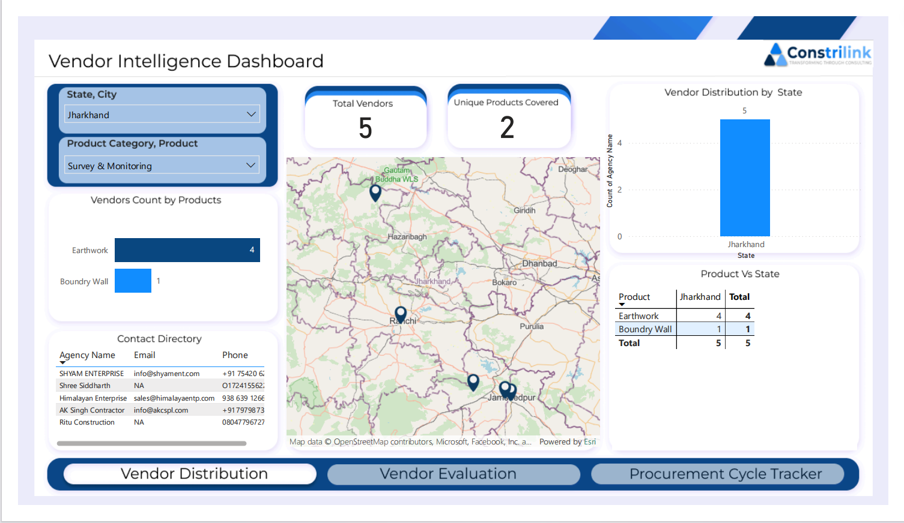

# 🌍 Vendor Intelligence & Procurement Analytics Dashboard

<p align="center">
  
</p>

<p align="center">


</p>

---

# 🎯 Executive Summary

The **Vendor Intelligence Dashboard** is a Power BI-based Business Intelligence solution designed to help procurement teams discover, evaluate, and manage suppliers efficiently.

The dashboard combines vendor master data, product categories, location intelligence, and supplier contact information into a centralized platform that supports procurement planning and strategic sourcing decisions.

---

# 🏢 Business Problem

Large organizations often face procurement challenges such as:

🔴 Difficulty identifying vendors by location

🔴 Limited visibility into supplier availability

🔴 Supplier concentration risk

🔴 Lack of centralized vendor information

🔴 Slow vendor discovery process

🔴 Inefficient sourcing decisions

### 💡 Business Solution

The dashboard provides a single source of truth for vendor intelligence by integrating:

✅ Geographic vendor mapping

✅ Product category coverage

✅ Contact management

✅ Vendor distribution analysis

✅ Procurement decision support

---

# 🏗️ Solution Architecture

```text
Vendor Master Database
        │
        ▼
Excel Data Sources
        │
        ▼
Data Cleaning & Enrichment
        │
        ▼
Power Query Transformation
        │
        ▼
Power BI Data Model
        │
        ▼
Vendor Intelligence Dashboard
        │
        ▼
Procurement Decision Support
```

---

# 🛠️ Technology Stack

| Technology       | Purpose                         |
| ---------------- | ------------------------------- |
| 📊 Power BI      | Dashboard Development           |
| 📄 Excel         | Vendor Data Source              |
| 🔄 Power Query   | Data Transformation             |
| 🧮 DAX           | KPI Calculations                |
| 🗺️ ArcGIS Maps  | Geographic Vendor Visualization |
| 📈 Data Modeling | Business Analytics              |

---

# 📂 Repository Contents

| File                                              | Description                    |
| ------------------------------------------------- | ------------------------------ |
| 📊 Vendor Dashboard.pbix                          | Interactive Power BI Dashboard |
| 📋 Enriched_Vendor_Data_with_Category.xlsx        | Vendor Master Dataset          |
| 🏷️ Product_Category_Mapping.xlsx                 | Product Category Mapping       |
| 📚 MCDM Model for Construction Material Suppliers | Vendor Evaluation Framework    |
| 📑 Supplier Selection Research Paper              | Procurement Research Reference |

---

# 📸 Dashboard Overview

## 🌍 Vendor Distribution Dashboard



### Dashboard Components

📍 Interactive Vendor Map

🏢 Vendor Distribution by State

📦 Product Category Analysis

📇 Vendor Contact Directory

📊 Product-wise Vendor Coverage

🎯 Procurement Intelligence

---

# 📊 Key Performance Indicators

| KPI                          | Value           |
| ---------------------------- | --------------- |
| 🏢 Total Vendors             | 5               |
| 📦 Unique Product Categories | 2               |
| 🌍 States Covered            | 1               |
| 📍 Vendor Locations          | Multiple Cities |
| 📇 Contact Records           | Available       |

---

# 🔍 Business Insights

## 🌍 Geographic Vendor Coverage

### Findings

The vendor network is concentrated within Jharkhand and includes suppliers across multiple cities.

### Insight

Location-based supplier mapping enables procurement teams to identify vendors closest to project locations.

### Business Value

✅ Reduced transportation cost

✅ Faster material delivery

✅ Better regional sourcing decisions

---

## 📦 Product Category Analysis

### Vendor Coverage

| Product Category | Vendors |
| ---------------- | ------- |
| Earthwork        | 4       |
| Boundary Wall    | 1       |

### Insight

Earthwork services have strong supplier availability while Boundary Wall services have limited coverage.

### Risk

⚠ Vendor dependency for specific product categories.

### Recommendation

Expand vendor onboarding in underrepresented categories.

---

## 🏢 Vendor Concentration Risk

### Observation

All suppliers currently belong to a single state.

### Business Risk

Heavy dependence on one region increases supply chain vulnerability.

Potential risks:

* Local disruptions
* Vendor shortages
* Regional market fluctuations

### Recommendation

Develop a geographically diversified vendor ecosystem.

---

## 📞 Vendor Contact Intelligence

### Available Information

✔ Agency Name

✔ Email Address

✔ Phone Number

### Business Impact

Procurement teams can instantly contact suppliers without searching across multiple systems.

### Benefits

* Faster RFQ process
* Improved supplier communication
* Reduced procurement cycle time

---

## 🚚 Logistics & Procurement Planning

### Observation

Geospatial vendor mapping supports proximity-based sourcing.

### Benefits

* Lower transportation costs
* Faster lead times
* Reduced project delays

### Recommendation

Integrate delivery performance metrics for enhanced decision-making.

---

# 📈 Strategic Business Recommendations

## 🏢 Vendor Expansion Strategy

* Increase vendor coverage across multiple states.
* Create category-specific supplier networks.
* Maintain backup supplier databases.

---

## 📦 Category Optimization

Focus on increasing suppliers for:

* Boundary Wall Services
* Specialized Construction Activities
* High-demand procurement categories

---

## 🌍 Geographic Diversification

Reduce concentration risk by onboarding suppliers from:

* Bihar
* Odisha
* West Bengal
* Chhattisgarh

---

## 🤝 Supplier Relationship Management

Implement:

* Vendor Rating System
* Supplier Scorecards
* Performance Tracking
* Delivery Reliability Monitoring

---

# 🚀 Future Enhancements

## Advanced Procurement Analytics

📊 Vendor Performance Dashboard

📈 Procurement Spend Analysis

🎯 Category-wise Vendor Ranking

⚠ Vendor Risk Assessment

📉 Procurement Trend Analysis

---

## AI & Predictive Analytics

🤖 AI-based Vendor Recommendation Engine

📍 Smart Vendor Shortlisting

📊 Supplier Reliability Prediction

⚡ Automated Procurement Suggestions

🔮 Procurement Demand Forecasting

---

# 🎓 Learning Outcomes

This project helped me gain hands-on experience in:

✅ Power BI Dashboard Development

✅ Vendor Intelligence Analytics

✅ Procurement Analytics

✅ Supply Chain Management

✅ Geographic Data Visualization

✅ Data Modeling & Relationships

✅ DAX Measures & KPIs

✅ Business Intelligence Storytelling

---

# 💼 Business Impact

The dashboard enables procurement teams to:

✔ Improve sourcing decisions

✔ Reduce procurement cycle time

✔ Minimize transportation costs

✔ Enhance supplier visibility

✔ Improve procurement planning

✔ Strengthen supply chain resilience

---

# 👨‍💻 Author

## Kaushal Kumar

📊 Data Analyst

📈 Power BI Developer

🏗️ Supply Chain & Procurement Analytics Enthusiast

Transforming vendor data into actionable business intelligence.

---

## ⭐ Support

If you found this project useful:

🌟 Star this repository

🍴 Fork the project

📢 Share feedback

🤝 Connect and collaborate

Together, let's build data-driven procurement solutions.
